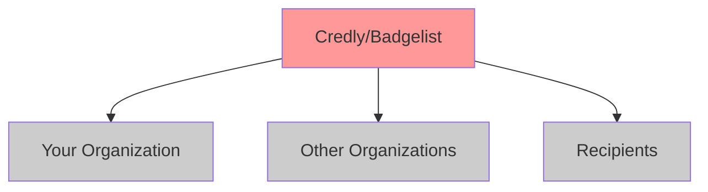

# **Decentralised Badges with BadgeFed**

## Implementing ActivityPub-based Credentials for Non-Profits

**FOSDEM 2025**  
*Breaking free from vendor lock-in in digital credentialing*

---

# About Me

- **Developer & Open Source Advocate**
- **Volunteer at SOMOS.tech** - Supporting Latino tech communities
- **Creator of BadgeFed** - Born from real nonprofit needs
- **Community Credentials** - Empowering organizations with federated badges

*communitycredentials.org*

---

# The Problem We Faced

At SOMOS.tech, we needed digital badges for:

- ✅ **Volunteer recognition**
- ✅ **Skill tracking** 
- ✅ **Event participation**

But traditional platforms like Credly were:

- 💰 **Too expensive** for nonprofits
- 🔒 **Vendor lock-in** concerns
- 🚫 **Rigid workflows** that didn't fit our needs

---

# What Are Digital Badges?


**Digital credentials that represent:**
- Skills and competencies
- Achievements and participation
- Learning outcomes
- Community contributions

**Standards-based** (Open Badges 2.0/3.0)
**Verifiable and portable**
**Rich metadata about earning criteria**

---

# Traditional Badge Platforms: The Problem



- **Single point of failure**
- **High costs** ($1000s/year)
- **No interoperability**
- **Data ownership unclear**

---

# The Federated Alternative

```marp
graph LR
    A[SOMOS.tech<br/>BadgeFed] <--> B[Community<br/>Credentials]
    B <--> C[Other Nonprofit<br/>Instance]
    A <--> D[Mastodon/<br/>Fediverse]
    C <--> D
    
    style A fill:#99ff99
    style B fill:#99ff99
    style C fill:#99ff99
    style D fill:#99ccff
```

**Decentralized, interoperable, and cost-effective**

---

# Enter BadgeFed


**Open-source, federated badge system**

- 🌐 **Built on ActivityPub protocol**
- 🏅 **Open Badges 2.0/3.0 compliant**
- 🏠 **Self-hostable** 
- 💰 **Cost-effective** for nonprofits
- 🔓 **No vendor lock-in**
- 🚀 **Deploy in minutes**

*100% Open Source (LGPL License)*

---

# How BadgeFed Works: The Stack

## **ActivityPub Protocol**
- Issuers become ActivityPub Actors
- Badges distributed as ActivityPub Notes
- Federation enables cross-instance sharing

## **Open Badges Standard**
- Badges attached as OpenBadge 2.0 assertions
- Rich metadata and verification
- Industry-standard compliance

## **.NET 9 Application**
- Modern, performant web application
- OAuth integration (Mastodon, LinkedIn)
- Email notifications and admin tools

---

# ActivityPub + Badges: Technical Deep Dive

```json
{
  "@context": "https://www.w3.org/ns/activitystreams",
  "id": "https://badges.somos.tech/grant/123",
  "type": "Note",
  "content": "🏅 SOMOS.tech Community Leader Badge awarded to @maria",
  "attributedTo": "https://badges.somos.tech/actors/somos.tech",
  "attachment": [{
    "@context": "https://w3id.org/openbadges/v2",
    "type": "Assertion",
    "recipient": { "type": "url", "identity": "https://mastodon.social/@maria" },
    "badge": "https://badges.somos.tech/badges/community-leader",
    "verification": { "type": "HostedBadge" },
    "issuedOn": "2025-02-01T10:00:00Z"
  }]
}
```

---

# Security & Verification

## **Triple Verification System**

1. **ActivityPub Signatures** - HTTP signatures verify sender authenticity
2. **OpenBadge Signatures** - Cryptographic integrity of badge data  
3. **Actor-Issuer Linking** - Badge issuer URL must match ActivityPub actor

## **Recipient Protection**
- Recipients must be mentioned in ActivityPub Note
- Prevents badge spoofing and misattribution
- Federated identity verification

---

# Federation in Action

```marp
sequenceDiagram
    participant S as SOMOS.tech Instance
    participant C as Community Credentials
    participant M as Mastodon User
    
    S->>S: Issue "Volunteer Leader" badge
    S->>C: ActivityPub Note with badge
    S->>M: Notify recipient via mention
    C->>C: Import and verify badge
    M->>M: Badge appears in social feed
    Note over S,M: Cross-platform visibility
```

**Badges flow seamlessly across the Fediverse**

---

# Community Credentials: Real-World Impact


**Empowering nonprofits with federated credentialing**

- 🏛️ **Hosted BadgeFed instances**
- 🔧 **Setup and configuration support**
- 📚 **Training and best practices**
- 🤝 **Community of practice**

*Supporting organizations like SOMOS.tech*

---

# SOMOS.tech Success Story

## **Before BadgeFed**
- No recognition system for volunteers
- Skills tracking was manual and inconsistent
- Event participation went unrecorded

## **After BadgeFed**
- ✅ **200+ badges** issued to volunteers
- ✅ **Federated recognition** across tech communities
- ✅ **$0 annual cost** vs $3000+ for commercial platforms
- ✅ **Community ownership** of credential data

---

# Benefits of Federated Badges

## **For Organizations**
- 💰 **Cost savings** (hosting vs licensing)
- 🏠 **Data sovereignty** and control
- 🔧 **Customizable workflows**
- 🌐 **Interoperability** with other instances

## **For Recipients**
- 📱 **Social media integration** 
- 🔄 **Portable credentials** across platforms
- 🔍 **Enhanced discoverability**
- 🛡️ **Future-proof** against platform shutdowns

---

# Current Challenges

## **Federation Scaling**
- Discovery across large networks
- Performance with many federated instances

## **Search & Discovery**
- Cross-instance badge search needs improvement
- Reputation and trust systems

## **Identity Portability**  
- Moving credentials between platforms
- Account migration scenarios

## **Moderation & Trust**
- Preventing spam and low-quality badges
- Building reputation systems

---

# Technical Architecture

```marp
graph TB
    subgraph "BadgeFed Instance"
        A[Web Interface] --> B[Badge Management]
        B --> C[ActivityPub Engine]
        C --> D[OpenBadge Processor]
        D --> E[Database & Storage]
    end
    
    subgraph "Federation"
        F[Other BadgeFed] 
        G[Mastodon/Pleroma]
        H[PeerTube/Pixelfed]
    end
    
    C <--> F
    C <--> G  
    C <--> H
```

---

# Deployment Options

## **Docker (Recommended)**
```bash
docker run -d -p 5000:80 \
  -e "MastodonConfig__Server=hachyderm.io" \
  -e "AdminAuthentication__AdminUsers__0__Id=admin" \
  -v $(pwd)/data:/app/data \
  badgefed/badgefed
```

## **Self-Hosted**
- .NET 9 runtime required
- SQLite database (default) or PostgreSQL  
- Reverse proxy (nginx/Apache) recommended

## **Community Credentials Hosting**
- Managed instances for nonprofits
- Setup, maintenance, and support included

---

# Getting Started: 5 Steps

## 1. **Choose Deployment**
- Self-host or Community Credentials

## 2. **Configure OAuth** 
- Mastodon and/or LinkedIn integration

## 3. **Set Up Admin Users**
- Define who can issue badges

## 4. **Create Badge Classes**
- Design criteria and metadata

## 5. **Start Issuing!**
- Awards federate automatically

**Full documentation:** *github.com/tryvocalcat/badgefed*

---

# Demo: Badge Issuance Flow

## Live Demo
1. **Create a badge class** - "FOSDEM 2025 Attendee" 
2. **Issue to recipient** - Mention @username
3. **ActivityPub distribution** - Federated automatically
4. **Verification** - Check on recipient's timeline
5. **Cross-instance visibility** - Badge appears everywhere

*Let's see it in action!*

---

# Future Roadmap

## **Short Term (2025)**
- 🔍 **Enhanced search** across federation
- 🏷️ **Badge collections** and portfolios
- 🔗 **Better identity linking** systems

## **Medium Term**
- 🤖 **AI-powered** badge recommendations  
- 📊 **Analytics dashboard** for organizations
- 🌐 **Integration APIs** for existing tools

## **Long Term**
- 🆔 **Decentralized identity** integration (DID)
- ⛓️ **Blockchain anchoring** options
- 🏛️ **Governance frameworks** for federation

---

# How You Can Contribute

## **As a Developer**
- 🔧 Contribute to core BadgeFed development
- 🎨 Build themes and UI improvements  
- 🔌 Create integrations with other platforms
- 📚 Improve documentation and tutorials

## **As an Organization**
- 🏃 Deploy BadgeFed for your community
- 🤝 Join Community Credentials network
- 📢 Share your use case and feedback
- 💡 Request features for your needs

*github.com/tryvocalcat/badgefed*

---

# Use Cases Beyond Nonprofits

## **Educational Institutions**
- Student achievement tracking
- Continuing education credits
- Research participation

## **Professional Communities** 
- Conference attendance
- Skill certifications
- Community contributions

## **Corporate Training**
- Employee development
- Compliance tracking
- Internal recognition

**Federated badges work everywhere credentials matter**

---

# The Social Web Future

## **Vision: Credentials as a Social Object**

- 🏅 **Badges live where people are** - in their social feeds
- 🤝 **Communities recognize each other** - cross-organizational validation  
- 📱 **Portable professional identity** - own your credentials
- 🌐 **Open ecosystem** - no single platform controls the narrative

**BadgeFed is building this future today**

---

# Join the Movement

## **Try BadgeFed**
- 🚀 **Deploy in minutes:** *github.com/tryvocalcat/badgefed*
- 🏛️ **Get hosted support:** *communitycredentials.org*
- 💬 **Join the community:** Matrix/Discord channels

## **Connect With Us**
- **Blog:** *badgefed.vocalcat.com*
- **SOMOS.tech:** Supporting Latino tech communities
- **Community Credentials:** Nonprofit credentialing services

## **Questions?**
*Let's talk about federated credentials!*

---


# Thank You!

## **Decentralised Badges with BadgeFed**

**Let's build a credentialing system that belongs to all of us**

🌐 **github.com/tryvocalcat/badgefed**  
🏛️ **communitycredentials.org**  
🤝 **somos.tech**

*Questions? Let's federate some credentials!*

---

# Appendix: Technical Resources

## **Key Links**
- BadgeFed GitHub: *github.com/tryvocalcat/badgefed*
- ActivityPub Spec: *w3.org/TR/activitypub*
- Open Badges: *openbadges.org*
- Community Credentials: *communitycredentials.org*

## **Sample Deployments**
- Production: *badges.vocalcat.com*
- SOMOS.tech: *badges.somos.tech*
- Demo: *demo.communitycredentials.org*

## **Documentation**
- Setup Guide: */USAGE.md*
- Technical Details: */DETAILS.md*
- API Reference: */docs/api*